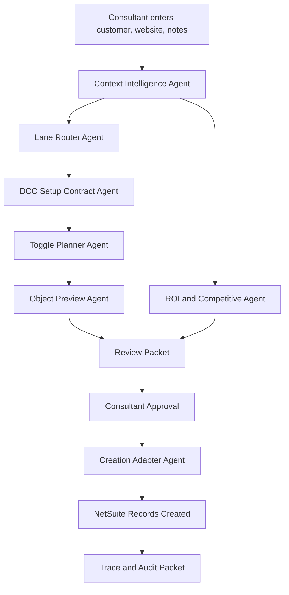

# Productized Creation And Consultant UX Architecture

Generated: 2026-05-09

## Product Direction

The Intelligent Demo Builder must become more than a side-panel checklist. It should be a consultant operating layer that turns prospect context into a lane-safe NetSuite demo setup, previews the exact records and objects that will be created, lets the consultant choose the DCC-style toggles, and eventually creates the setup through a governed adapter.

The current direction is correct, but the last implementation exposed a gap: richer words do not equal richer setup. The next architecture must make the functional build path tangible.

## Product Goals

1. Convert customer, website, and notes into a specific demo build packet.
2. Keep DCC V4 toggles visible and controllable: new item, manufacturing, WIP.
3. Use website and N/LLM context to suggest customer-specific item names, not generic object names.
4. Fall back to lane-specific industry naming only when customer-specific signals are weak.
5. Add Apparel & Accessories as an authorized lane so apparel does not collapse into Industrial Equipment.
6. Make ROI and competitive positioning prominent enough for a consultant to use live.
7. Move from dry-run preview to governed object creation.
8. Keep NetSuite positioned as the strongest solution through provable workflow value, not unsupported claims.

## Current Corrections

Completed in the current package:

- Apparel & Accessories is now an authorized lane with `Style / SKU Matrix` proof.
- Functional setup includes the Apparel & Accessories DCC-style path.
- Setup plan includes consultant-controlled toggles for new item, manufacturing, and WIP.
- Object previews now use customer, website, and notes signals before falling back to industry names.
- Liquid Death and Keebler style signals produce more specific product-preview names.
- Value lens is shown earlier in Run so ROI and competitive framing are harder to miss.
- Validator now expects seven authorized lanes and toggle controls.

## Experience Principle

The consultant should be able to answer four questions at a glance:

- What story am I telling?
- What value am I proving?
- What will be built?
- What do I do next?

Everything else should be either collapsed, secondary, or available in Trace.

## System Architecture

## Agent Roles

### Agent A: Context Intelligence Agent

Goal: Turn customer, website, and notes into product cues.

Owns:

- Website/domain interpretation.
- Notes interpretation.
- Product category extraction.
- Named item suggestions.
- Confidence score.
- Fallback decision.

Must not:

- Change lane authority without consultant approval.
- Invent unsupported product facts.
- Create records.

Output:

- `customerName`
- `websiteDomain`
- `productSignals`
- `suggestedItemNames`
- `confidence`
- `fallbackReason`

### Agent B: Lane Router Agent

Goal: Select or recommend the correct lane.

Owns:

- Food / Beverage vs Products CPG distinction.
- Apparel & Accessories detection.
- Dealer vs branch distribution distinction.
- Life sciences / regulated release detection.
- Guardrail explanation.

Must not:

- Automatically switch lanes without an Apply action.
- Collapse apparel into industrial equipment.
- Override the proof anchor.

Output:

- `suggestedLane`
- `currentLane`
- `confidence`
- `why`
- `guardrails`

### Agent C: DCC Setup Contract Agent

Goal: Convert the lane into the inherited DCC V4 setup path.

Owns:

- Customer record.
- Sales order view.
- Hero/proof item.
- Supporting proof records.
- DCC family key.
- DCC scenario.

Must not:

- Create unsupported records.
- Remove required base records.
- Change DCC toggles without consultant input.

Output:

- `dccFamilyKey`
- `dccScenario`
- `recordsToPlan`
- `proofAnchor`
- `baseToggles`

### Agent D: Toggle Planner Agent

Goal: Let the consultant choose the functional build depth.

Owns:

- `createNewHeroItem`
- `enableManufacturing`
- `enableWip`
- Warnings when a toggle increases build complexity.
- Adapter payload toggle sync.

Must not:

- Hide toggles.
- Enable WIP silently.
- Create manufacturing objects when manufacturing is off.

Output:

- `selectedToggles`
- `toggleWarnings`
- `objectScope`

### Agent E: Object Preview Agent

Goal: Show what the system intends to create before it creates anything.

Owns:

- Proposed object names.
- Record type.
- Intended fields.
- Source reason.
- Dependencies.
- Missing required fields.
- Fallback names.

Must not:

- Show only generic names when website or notes provide useful signals.
- Hide fallback naming.
- Treat preview as created state.

Output per object:

- `recordLabel`
- `recordType`
- `proposedName`
- `fallbackName`
- `intendedFields`
- `dependencies`
- `createOrder`
- `reviewStatus`

### Agent F: ROI And Competitive Proof Agent

Goal: Give the consultant usable value proof during the live demo.

Owns:

- ROI headline.
- Business risk reduced.
- Competitive contrast.
- NetSuite proof point.
- Consultant talk track.

Must not:

- Make unsupported competitor claims.
- Turn the drawer into a marketing essay.
- Bury ROI below low-value controls.

Output:

- `roiHeadline`
- `riskReduced`
- `competitiveContrast`
- `netsuiteProofPoint`
- `talkTrack`

### Agent G: Consultant UX Council

Goal: Make the drawer usable under demo pressure.

Members:

- Redwood UX Lead.
- Sales Engineering Lead.
- NetSuite Functional Lead.
- Accessibility Reviewer.
- Demo Storytelling Lead.

Owns:

- First viewport design.
- Review packet readability.
- Primary action hierarchy.
- Progressive disclosure.
- Error and warning wording.

Must not:

- Add more cards when one grouped section is clearer.
- Put live-demo-critical actions below long explanatory copy.
- Depend on color alone.

### Agent H: Creation Adapter Agent

Goal: Create NetSuite objects only after the packet is reviewed and approved.

Owns:

- Adapter capability state.
- Payload validation.
- Record creation sequence.
- Created record IDs and URLs.
- Failure and retry handling.
- Trace evidence.

Must not:

- Create without adapter support.
- Create without explicit consultant confirmation.
- Create objects outside the reviewed packet.
- Continue silently after a failed dependency.

## Productized Prompt Blocks

### Prompt P1: Apparel Lane Authority

Objective: Add Apparel & Accessories as a first-class lane.

Agents: Lane Router Agent, DCC Setup Contract Agent, Validation Engineer.

Goals:

- Detect apparel, accessories, footwear, style, size, color, collection, allocation, and channel signals.
- Route to Apparel & Accessories instead of Industrial Equipment.
- Use `Style / SKU Matrix` as proof anchor.

Acceptance:

- Apparel lane appears in lane picker.
- Apparel signals recommend Apparel & Accessories.
- Apparel setup path includes style/SKU matrix and size/color variants.
- Preflight validates seven authorized lanes.

### Prompt P2: DCC Toggle Control

Objective: Make DCC-style toggles an explicit part of setup.

Agents: Toggle Planner Agent, NetSuite Object Architect, UX Council.

Goals:

- Add new item, manufacturing, and WIP controls.
- Explain object impact when toggles change.
- Sync toggles into dry-run and adapter payloads.

Acceptance:

- Consultant can change toggles before Review.
- Packet updates object scope.
- WIP never turns on silently.
- Trace records toggle changes.

### Prompt P3: Product-Specific Preview Intelligence

Objective: Replace generic preview labels with item-specific draft objects.

Agents: Context Intelligence Agent, Object Preview Agent, N/LLM Enrichment Architect.

Goals:

- Extract likely products from website/domain and notes.
- Generate named item previews.
- Fall back to lane-specific industry names only when confidence is low.
- Show source reason and confidence.

Acceptance:

- Liquid Death previews beverage item names.
- Keebler previews snack/cookie item names.
- Apparel prospects preview style/SKU matrix names.
- Low-context prospects use industry fallback and show why.

Status: Complete for local deterministic/N-LLM-ready preview. See `reports/p3_p4_product_preview_value_story.md`.

### Prompt P4: ROI And Competitive Above The Fold

Objective: Make value and competitive proof prominent enough for live use.

Agents: ROI And Competitive Proof Agent, Demo Storytelling Lead, UX Council.

Goals:

- Move ROI and competitive proof into the first usable viewport.
- Use one ROI headline, one risk-reduced statement, one NetSuite proof point.
- Keep competitor language truthful and workflow-based.

Acceptance:

- Consultant sees value before live controls.
- Copy is specific to lane and customer context.
- No unsupported claims.

Status: Complete in the drawer with a top `Value story` strip. See `reports/p3_p4_product_preview_value_story.md`.

### Prompt P5: Review Packet Productization

Objective: Make Review the place where the consultant validates the full build packet.

Agents: Object Preview Agent, NetSuite Object Architect, UX Council.

Goals:

- Group records by creation sequence.
- Show proposed names, record types, fields, dependencies, and toggle source.
- Collapse secondary field details.
- Surface missing context and create blockers.

Acceptance:

- Review answers what will be built.
- The consultant can approve or revise before creation.
- No generic `Customer - Finished Good` style names when better product signals exist.

Status: Complete for review-only build packet. See `reports/p5_review_packet_productization.md`.

### Prompt P6: Creation Adapter MVP

Objective: Create reviewed records through a governed NetSuite adapter.

Agents: Creation Adapter Agent, NetSuite Functional Lead, Validation Engineer.

Goals:

- Start with one controlled lane.
- Create customer, sales order view context, and hero/proof item first.
- Capture created IDs and URLs.
- Fail closed on incomplete payloads.

Acceptance:

- Create button stays locked until adapter available, packet reviewed, and consultant confirms.
- Created objects match preview packet.
- Trace contains adapter result.

### Prompt P7: Creation Expansion

Objective: Expand creation lane by lane after MVP success.

Agents: Creation Adapter Agent, Lane Router Agent, Release Captain.

Goals:

- Add supported records per lane.
- Validate each lane with fixture-like acceptance.
- Keep unsupported objects preview-only.

Acceptance:

- Every lane has a create-supported matrix.
- Unsupported records are visible but blocked.
- No lane creates unreviewed objects.

### Prompt P8: Consultant UX Redesign

Objective: Redesign the drawer around consultant storytelling and fast build control.

Agents: Consultant UX Council.

Goals:

- Replace document-like stacked cards with a tighter cockpit.
- Add a persistent story bar: customer, lane, proof, value, create state.
- Make ROI/competitive a visible top panel or pinned strip.
- Turn object preview into a scan-first packet.
- Keep Trace and advanced detail out of the live path.

Acceptance:

- First viewport shows story, value, and next action.
- Review shows build packet without overwhelming text.
- Run lets the consultant act without scrolling through setup details.
- Clear session remains easy but not distracting.

Status: Complete for the current drawer cockpit pass. See `reports/p8_consultant_ux_redesign.md`.

### Prompt P9: Productized Release Packaging

Objective: Move from script package to productized repo release.

Agents: Release Captain, Validation Engineer, Documentation Lead.

Goals:

- Versioned release artifact.
- Install instructions.
- Smoke test script.
- Adapter support matrix.
- Known limitations.

Acceptance:

- GitHub repo can be cloned and validated.
- Tampermonkey install path is obvious.
- Release checklist is repeatable.
- Productized docs match actual behavior.

## UI Recommendation

The drawer should be redesigned into four stable regions:

1. Story Bar: customer, lane, proof, ROI headline, create state.
2. Setup Builder: customer inputs, toggles, lane recommendation, apply controls.
3. Build Packet: exact objects, proposed names, fields, dependencies, create readiness.
4. Live Run: next move, NetSuite proof point, competitive contrast, live controls.

Trace should stay available, but it should not compete with the consultant's live demo flow.

## Creation Readiness Ladder

### Level 0: Preview Only

Current state. The drawer previews what would be built and blocks creation.

### Level 1: Adapter Connected

The drawer can validate adapter capability but still requires review and confirmation.

### Level 2: Single-Lane MVP Create

One lane creates customer, transaction context, and hero/proof item.

### Level 3: Toggle-Aware Create

New item, manufacturing, and WIP toggles affect the object graph.

### Level 4: Seven-Lane Create Matrix

Each authorized lane has supported and unsupported object coverage.

### Level 5: Productized Release

Versioned repo, repeatable install, governed trace, adapter support matrix, and release notes.

## Non-Regression Rules

- Seven authorized lanes only unless a new lane is explicitly approved.
- Apparel & Accessories must not route to Industrial Equipment when apparel signals are present.
- No proof-anchor changes without explicit lane-contract update.
- No automatic lane switch.
- No automatic record creation.
- No hidden writes.
- DCC toggles must be visible before creation.
- Creation must match the reviewed packet.
- ROI and competitive proof must remain truthful, workflow-based, and NetSuite-centered.
- Product-specific previews must show source confidence and fallback reason.
- Unsupported objects stay preview-only.
