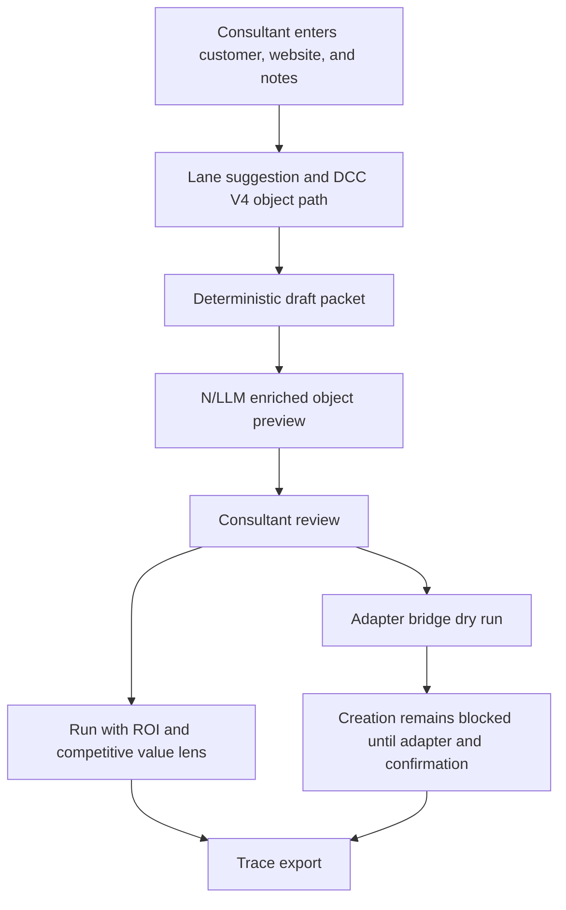

# Visual Value And Enriched Preview Architecture

Generated: 2026-05-09

## Current Run Findings

The current drawer is moving in the right direction: the consultant can enter customer context, confirm the lane, review the DCC V4 object path, move into Run, and keep the IDB context across NetSuite tabs during the active session.

The next release layer should focus on three adoption blockers:

- The companion needs a little more visual color while still feeling like Oracle Redwood.
- ROI and competitive framing need to be present without turning the drawer into a marketing document.
- Planned records need richer previews of the intended updates instead of generic deterministic labels such as `Keebler - Finished Good`.

## Product Decision

Keep the deterministic DCC V4 object path as the authority, then let the N/LLM layer enrich the review packet with preview text that is visible, compact, and advisory.

The enriched preview can suggest:

- Display name.
- Record purpose.
- Field assumptions.
- Demo-use note.
- Review flags.
- ROI and competitive proof sentence.

The enriched preview cannot:

- Change the lane.
- Change the proof anchor.
- Remove required DCC V4 records.
- Create records.
- Hide the deterministic fallback names.

## Redwood Visual System

Use color as semantic guidance, not decoration.

- Primary teal: recommended action and active state.
- Success green: setup ready, reviewed packet, safe active-session state.
- Amber: guardrails, review needed, pressure-test state.
- Slate: neutral object rows, context metadata, compact labels.
- Soft blue-gray: low-context NetSuite page signal and background panels.

Rules:

- No gradients, decorative blobs, or oversized hero treatment.
- Cards stay at 8px radius or less.
- Color accents appear on left rails, chips, tab active state, and key status strips.
- Text remains the primary information carrier; color only helps scan state and priority.

## Value And Competitive Layer

The value layer should be compact enough for live use:

- One ROI line: what business risk or value the proof reduces or unlocks.
- One competitive line: why the NetSuite path is stronger in the current story.
- One proof sentence: how the selected lane and proof anchor make it visible.

This appears in Run as a compact `Value lens`, and in Review as a short `Why this packet` line when space allows.

The value layer must be lane-specific and customer-aware, but it must not expand into long notes while the consultant is live.

## Enriched Object Preview Model

Review rows should move from generic planned names to an object preview:

- Object label: `Finished Good`.
- Proposed name: `Keebler Promotion Finished Good`.
- Intended update: `Tie ingredient sourcing, lot traceability, packaging readiness, and finished-good availability to the promotion story.`
- Key fields preview: `Item family`, `preferred vendors`, `lot control`, `location availability`, `quality hold signal`.
- Demo use: `Used as the proof anchor when the consultant validates readiness before demand spikes.`
- Status: `draft_only`, `review_ready`, or `needs_context`.

The preview is generated from:

- Customer name.
- Customer website.
- Conversation notes.
- Selected lane.
- Proof anchor.
- DCC V4 object path.
- Existing guardrails.

If enrichment is unavailable, the deterministic planned name remains the fallback.

## Roles

- Product Architect: owns scope, no-regression guardrails, and Monday release shape.
- Redwood UX Lead: owns color semantics, compact layout, and scan hierarchy.
- Consultant Workflow Lead: owns Plan / Review / Run / Trace usability during a live demo.
- ROI Story Lead: owns compact business-value framing.
- Competitive Positioning Lead: owns compact competitor-safe differentiation.
- N/LLM Enrichment Architect: owns advisory preview prompts and response contract.
- NetSuite Object Architect: owns DCC V4 object path parity and field-preview realism.
- Adapter Bridge Engineer: owns future create payload compatibility and creation gates.
- Validation Engineer: owns validator checks, trace payload checks, and no-regression evidence.
- Release Captain: owns GitHub package readiness and Monday stop/go.

## Objective Blocks

### Objective 1: Redwood Color Accent System

Make the drawer feel more alive without leaving the NetSuite theme.

Acceptance:

- Active tab, primary action, setup state, guardrail state, and review state have distinct semantic colors.
- No state depends on color alone.
- The first viewport remains compact.

### Objective 2: Compact ROI And Competitive Story

Make value and competitive context available at the exact moment the consultant needs it.

Acceptance:

- Run shows ROI and competitive context in two short lines.
- Review shows why the packet matters without pushing object rows too far down.
- Trace export includes the value lens used during the demo.

### Objective 3: N/LLM Object Preview

Replace generic object names with reviewable previews of what the system intends to prepare.

Acceptance:

- Every planned record has a proposed name, intended update, demo use, and field-assumption preview.
- Missing context produces a visible review flag.
- The deterministic planned name remains available as fallback.

### Objective 4: Adapter Payload Compatibility

Prepare enriched previews for future creation without enabling writes.

Acceptance:

- Adapter bridge request can carry enriched preview fields as advisory context.
- Create remains blocked without adapter support, reviewed packet, and explicit consultant confirmation.
- Failed enrichment never blocks deterministic dry-run packet review.

### Objective 5: Monday Release Candidate

Run a complete controlled smoke test with the current NetSuite script.

Acceptance:

- Plan / Review / Run / Trace are visually clean.
- Active session survives tab navigation and can be cleared.
- Value lens appears without clutter.
- Object previews are readable and reviewable.
- Preflight passes.

## Prompt Blocks

### Prompt M12: Redwood Color Accent System

Goal: Add restrained Redwood-aligned color depth to the companion.

Boundaries: No layout expansion; no lane changes; no proof-anchor changes; no creation changes; no decorative background art.

Output: semantic color tokens, tightened status accents, active tab/action styling, validator checks, visual notes.

### Prompt M13: Compact Value And Competitive Story

Goal: Integrate ROI and competitive positioning into the live story without adding clutter.

Boundaries: Two-line value lens by default; lane-specific and customer-aware; no broad marketing blocks; no unsupported claims.

Output: compact Run value lens, Review packet value sentence, trace export fields, validation coverage.

### Prompt M14: N/LLM Object Preview Renderer

Goal: Render reviewable object previews that show what each record is intended to become.

Boundaries: Advisory-only; deterministic fallback stays visible; no automatic create; no lane or proof-anchor override.

Output: object preview model, Review row rendering, enrichment fallback behavior, trace payload fields, validator coverage.

### Prompt M15: Enriched Adapter Payload Guard

Goal: Carry enriched object previews into the dry-run-to-create bridge without enabling writes.

Boundaries: Create remains blocked; adapter may consume enrichment only after review; confirmation is still required.

Output: enriched bridge payload shape, adapter compatibility notes, failure and rejection states.

### Prompt M16: Monday Release Candidate Smoke

Goal: Validate the complete controlled release candidate in NetSuite.

Boundaries: Acceptance only; no feature expansion during smoke; stop on visual, storage, trace, lane, or guard regression.

Output: Monday release candidate report, stop/go decision, install artifact confirmation.

## No-Regression Guards

- Seven authorized lanes only, including Apparel & Accessories.
- DCC V4 object path remains the authority.
- No proof-anchor changes.
- No automatic lane switch.
- No automatic record creation.
- No hidden writes.
- No unsupported object creation.
- No generic CPG drift outside the selected lane.
- Enrichment is advisory and reviewable.
- Enrichment cannot override required records.
- Value and competitive copy remains compact and lane-specific.
- Active session state remains time-bounded and clearable.
- Trace export remains browser-local.

## Conceptual Release Skeleton

